**Artificial Intelligence - Reinforcement Learning: Learning to Play Blackjack**
================================================================================
This is my reinforcement learning (RL) project; an agent that learns to play blackjack with the most optimal strategy.

Note: _This article assumes some prior knowledge of reinforcement learning theory and terminology._

Please see the code for the hyperparameters used for this experiment.

I'm using the _OpenAI Gym_ environment _Blackjack-v0_ as the environment for this project.


# Table of Contents
1. [Classical Reinforcement Learning - Monte Carlo Sampling](#a1)
2. [Deep Reinforcement Learning (Deep Q-Learning)](#a2)
3. [Results](#a3)
   1. [Expected Return Using the Optimal Policy](#a31)
   2. [Deep Q-Learning - Significant Factors Affecting Learning](#a32)
   3. [Learning Speed](#a33)
4. [Visualisation: Action-State Heatmaps](#a4)
   1. [Classical Q-Learning](#a41)
   2. [Deep Q-Learning](#a42)
   3. [Deep Q-Learning - Exploring & Visualising Neural Network's Ability to Generalise](#a43)
5. [Extension to Model-Based Learning](#a5)
6. [To Do](#a6)


First, I created an AI agent that learns through classical reinforcement learning, in order to first gain a basic understanding of RL. After this, I then extended this technique to deep Q-learning, using a neural network as a function approximator to predict the value of an action, given a state.

# Classical Reinforcement Learning - Monte Carlo Sampling
<a name="a1"></a>
The agent learns by using a Monte Carlo strategy to sample returns and create a table of the _Q-values_ of the game. That is, the expected return of taking action _a_, given state _s_ - formalised as _Q(s, a)_.

The action with the highest Q-value (expected return) for the given state is the optimal action to take.

A Monte Carlo sampling strategy was chosen because it performs well on episodic environments such as blackjack, where one episode (game) takes just three turns on average.


# Deep Reinforcement Learning (Deep Q-Learning)
<a name="a2"></a>
After successfully using classical Q-learning to generate a Q-table, the next step was to create a function approximator to replace the role of the Q-table.

In more mathematical terms this means using a neural network to approximate the function Q(s, a) i.e. the value of performing action _a_ in state _s_. This is often the only solution in environments where the state space is simply too large to use classical methods such as storing a Q-table of values.

Note: I am deliberately using a problem (the game of blackjack) with a small state space in order to be able to test the deep Q-learning network as a proof of concept. Having a smaller state space allows for faster training and therefore faster testing and experimentation.

The TensorFlow checkpoint file is included in case you wish to load my experimental results.

# Results
<a name="a3"></a>
## Expected Return Using the Optimal Policy
<a name="a31"></a>
After training for one million and then ten million games it can be found that the average score, given the optimal policy, converges to -0.12 i.e. playing blackjack under these specific rules gives a 0.12 advantage to the dealer/house in the long term.

Note: The environment does not allow insurance, splitting or doubling down on a hand.

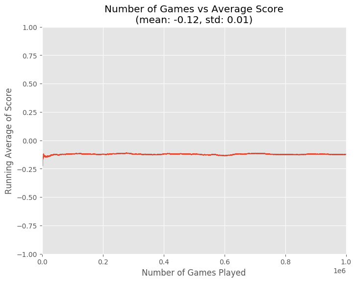


The deep Q-learning network achieved an expected return of around -0.1 which was actually better than the Q-table performance. Later I found that this was because the Q-table had not explored all of the states of the game.

## Deep Q-Learning - Significant Factors Affecting Learning
<a name="a32"></a>
I noticed that sufficient exploration of the game's states was the most significant factor affecting the neural network's performance during training.

For controlling the balance of exploration vs exploitation of the learned policy I used the _epsilon_-_greedy_ strategy. A variable, _epsilon_, is used to define the percentage of the time to choose a random action as opposed to the currently learned best action in the given state. This helps to explore more states and avoid being stuck in local minima when learning the optimal policy.

I added one change to this strategy and used a decaying epsilon-greedy to achieve a good balance of exploration and exploitation. With this technique the value of epsilon starts at 1 and linearly decays to a certain specified value by iteration _t_.

From experimentation I found that having epsilon decay to a final value of 0.1 in 7 × 10<sup>5</sup> iterations was the minimum amount of exploration required for satisfactory results.

Having more exploration may also have helped the classical Q-table method.

## Learning Speed
<a name="a33"></a>
With the Q-table learning I noticed that the agent very quickly learns to play with decent success.

After only ten thousand games, the agent approaches a value reasonably close to the true expected return (expected return from playing the optimal policy).

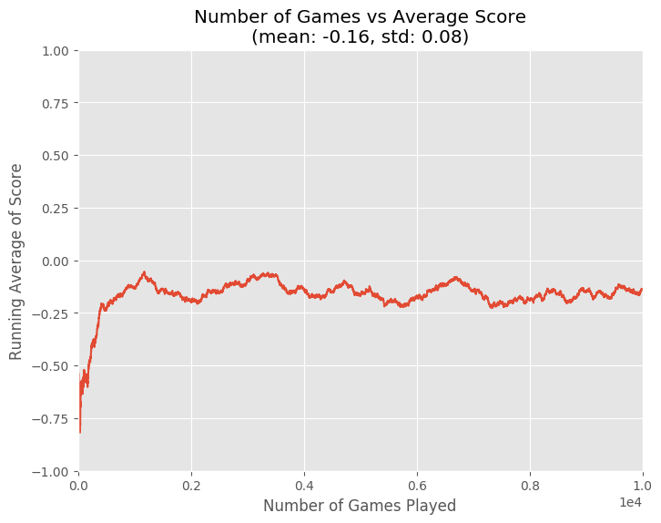

Looking at the logarithmic plots shows that the agent converges to within 33.33% of the true value within 10<sup>4</sup> games, and within 5% after 10<sup>5</sup> games. 

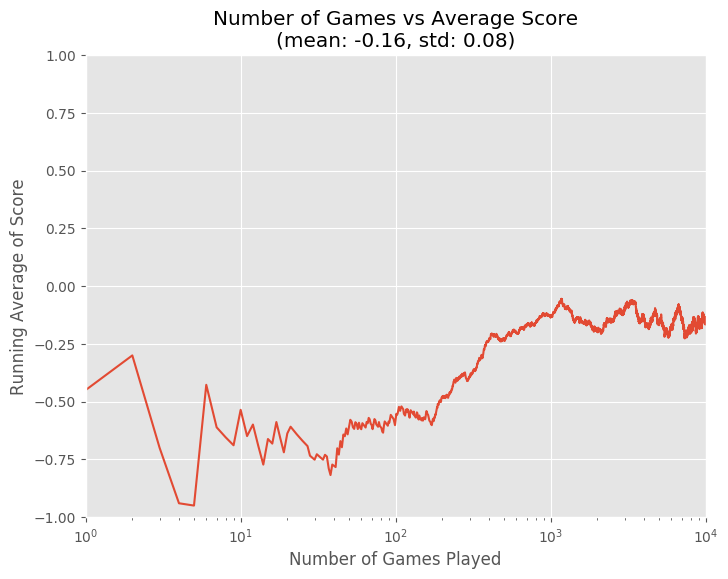
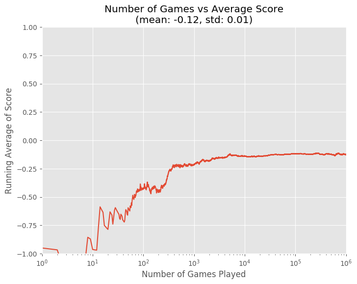
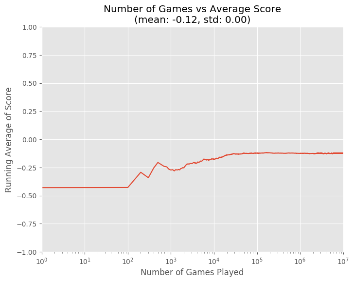

As expected, the deep Q-learning agent took much longer to converge - at least a million games are required for noticeable improvement.

# Visualisation: Action-State Heatmaps
<a name="a4"></a>
I plotted heatmaps of the action to take for a given state which made it easier to visualise the behaviour of the agents.

## Classical Q-Learning
<a name="a41"></a>
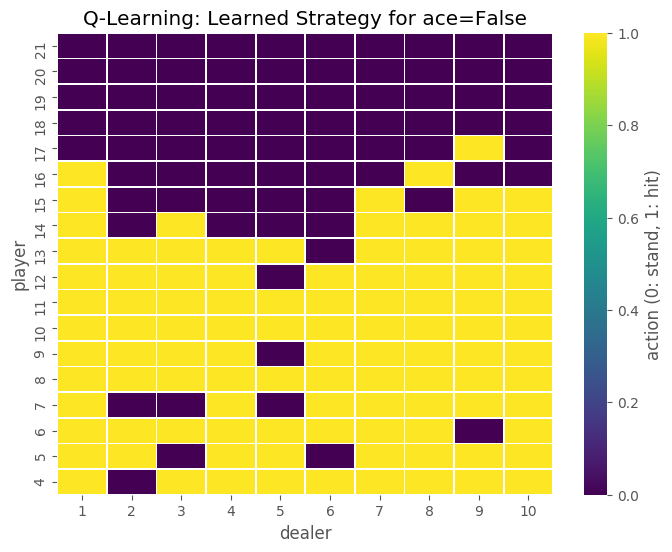
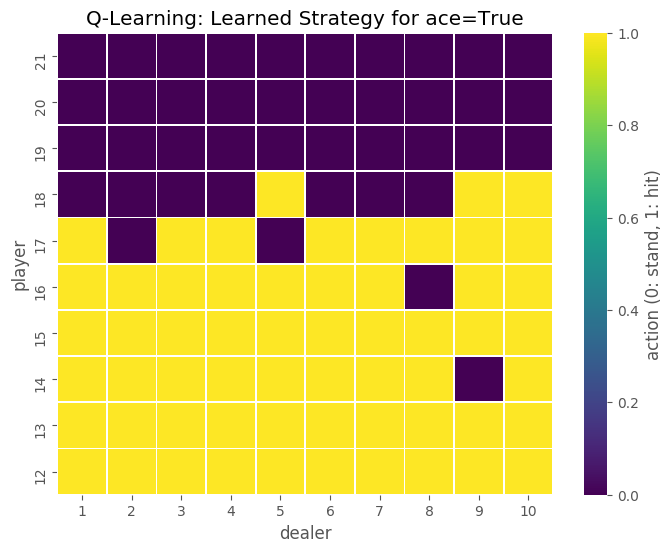

From the heatmaps we can see that not all of the states were explored sufficiently, as it is known that for any player hand below 13 without an ace should be a hit. Likewise, any player hand below a 18 with an ace should be a hit.

## Deep Q-Learning
<a name="a42"></a>
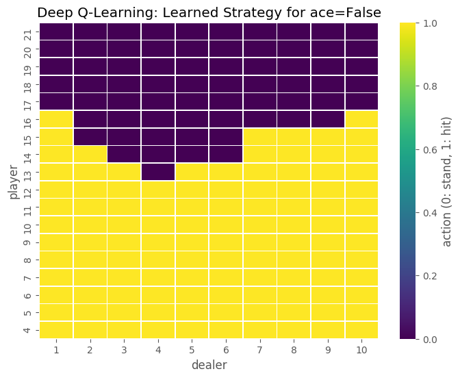
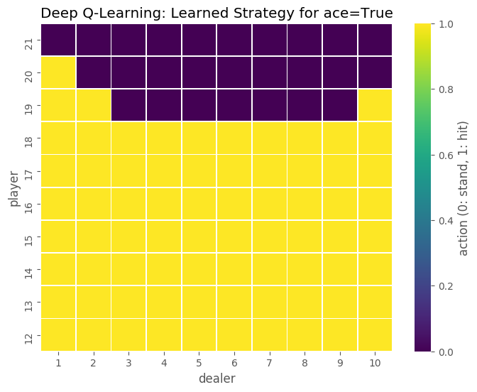

These results mimic those seen in studies of optimal plays in blackjack and so we can be certain that the neural network successfully learned the optimal strategy.

It should be noted that the classical Q-learning table could certainly achieve the same results if given more training.

## Deep Q-Learning - Exploring & Visualising Neural Network's Ability to Generalise
<a name="a43"></a>
Out of curiosity, I plotted the neural network's learned strategy for invalid game states i.e.  
> player's starting hand < 4 & dealer's starting hand > 10

This was to see how well the neural network generalised its learning to adapt to new scenarios.

For example, the environment the neural network trained on gives a starting state where the player draws two cards and the dealer draws one.

I wanted to investigate how the neural network responds to slightly different rules. In this case, I wanted to answer the question "What if the dealer were to now draw two cards?"

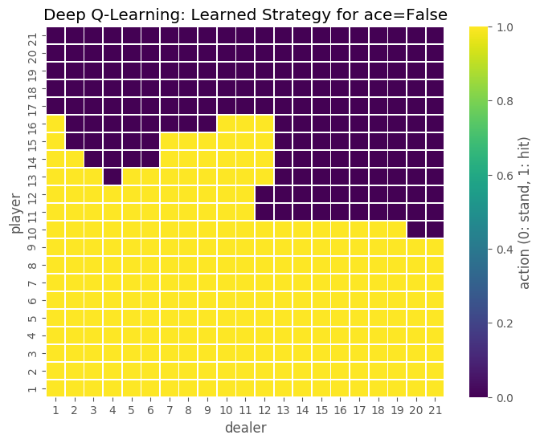
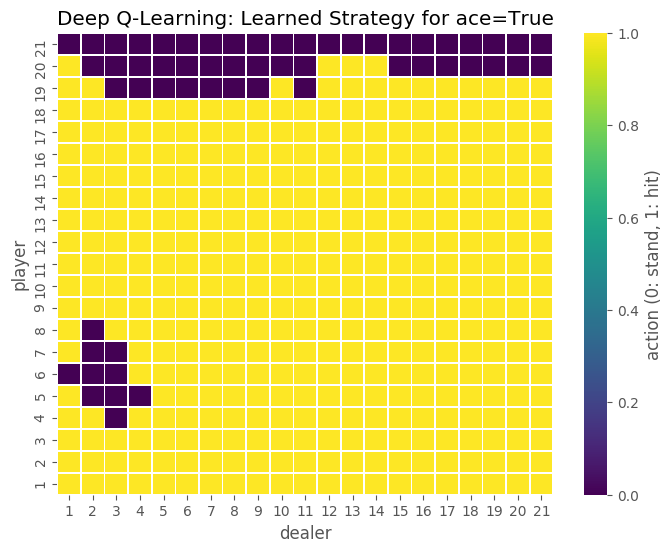

For player's starting hand < 4 we can see that the neural network correctly learned to always hit on low values.  
Curiously, there is the area on the bottom-left when ace=True that doesn't reflect this.

As well as the above peculiar exception, when ace=False and dealer > 11, then the player will stand on anything > 11.  
At first this seems like an incorrect strategy, however I speculate that it is possible the neural network has learned that the dealer **must** draw a card and therefore is more likely to run over 21. As the player always has the first turn, it makes sense to choose to sit in this situation.  
Given this scenario, I would still expect the player to hit on scores a bit higher than 12 as it seems more likely that the dealer could win. Running some simulations of this scenario could give an exact figure as to these probabilities but this is outside the scope of this project.


# Extension to Model-Based Learning
<a name="a5"></a>
By using information about the environment it is possible to achieve better performance.

Namely, if the agent can keep track of what cards have appeared in play i.e. "_card counting_", it can then make an even more informed decision. By modelling the state of the deck, greater accuracy can be achieved when predicting the probability of a card being drawn.

However, as I'm using the OpenAI Gym environment _Blackjack-v0_, the `draw_card` function simply generates a random number with no concept of a limited number of cards in the deck. See the source code below:

```python
def draw_card(np_random):
    return int(np_random.choice(deck))
```

In order to do model-based learning, an environment that includes a model of the state of the deck must first be created.

# To Do:
<a name="a6"></a>
- In the interests of possibly speeding up convergence time, find a smaller neural network architecture that gives similar results.

- Add ability to adjust learning rate while training.

- Add ability to use dropout while training.

- Update code to use the TensorFlow 2 API

